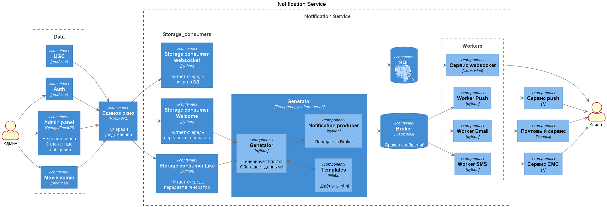

[](https://github.com/Dmitry426/Notifications_sprint/actions/workflows/python.yml)  


## Запуск приложения

### Development

Для запуска приложения в среде разработки доступны варианты запуска напрямую через `python` и
через `docker-compose`. Оба варианта используют для конфигурации переменные окружения, которые
описаны в файлах `services/workers/event_listeners/core/config.py` и `services/workers/messaging_workers/core/config.py`.
В данных режимах запуска доступно обновление кода приложения
на лету, без перезапуска (кроме случаев добавления новых зависимостей).

#### Python Runner

```bash
python -m app
```

#### Docker runner

```bash
docker-compose up -d
```

### Production docker

```bash
docker-compose -f docker-compose.prod.yml up -d
```

## Разработка

### Перед началом работы

```bash
make dev
```

Это позволит проверить внесённые изменения до их сохранения.

### Зависимости

Управлением зависимостями занимается утилита `poetry`. \
Перечень зависимостей находится в файле `pyproject.toml`. \
Инструкция по настройке poetry-окружения для
pyCharm [здесь](https://www.jetbrains.com/help/pycharm/poetry.html).

Для добавления зависимости достаточно написать `poetry add requests`, утилита сама подберёт версию,
не конфликтующую с текущими зависимостями. \
Зависимости с точными версиями фиксируются в файл `poetry.lock`. \
Для получения дерева зависимостей можно воспользоваться командой `poetry show --tree`. Остальные
команды доступны в официальной документации к утилите.


## Архитектура проекта


